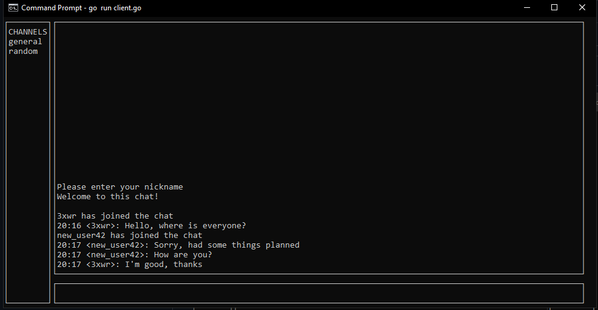

# SimpleChatGo: Simple chat written in Go

A simple chat written in Go.

Project is still WIP.

SimpleChatGo is built using a concurrent TCP server and a number of TCP clients. Each connection is handled by a  goroutine.

SimpleChatGo uses [tui-go](https://github.com/marcusolsson/tui-go) for its beautiful terminal interface.



## Installing required packages

```
go get github.com/marcusolsson/tui-go

```

